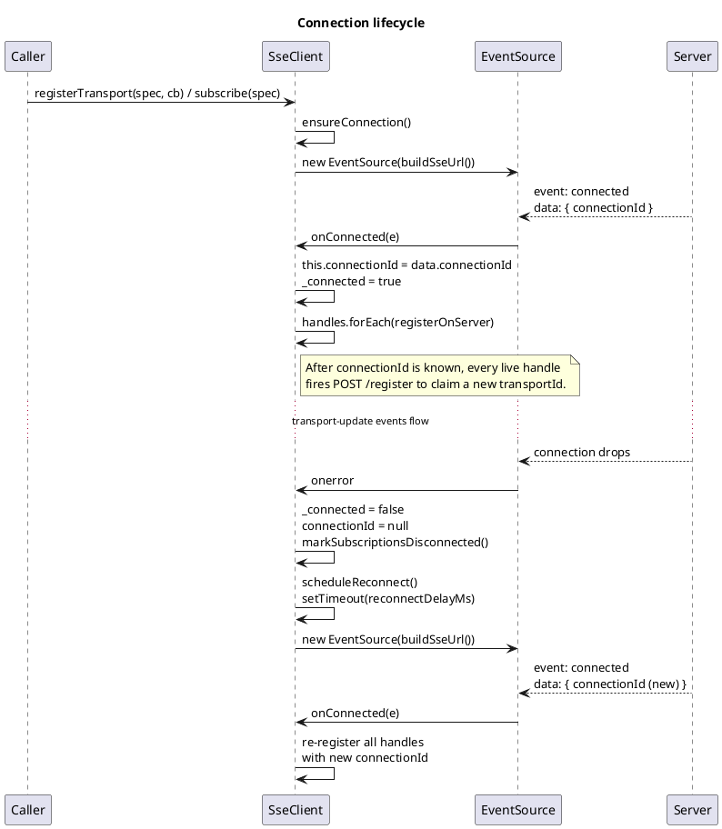
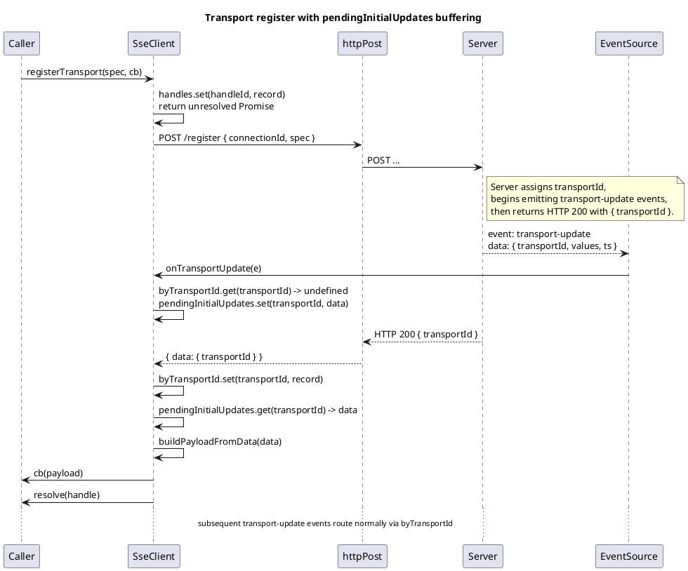
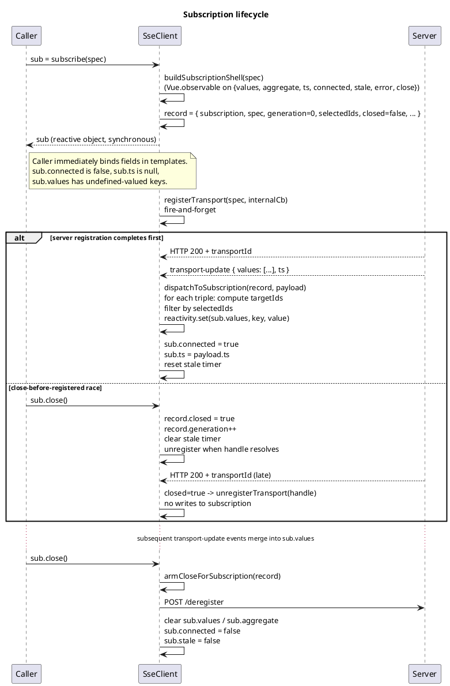
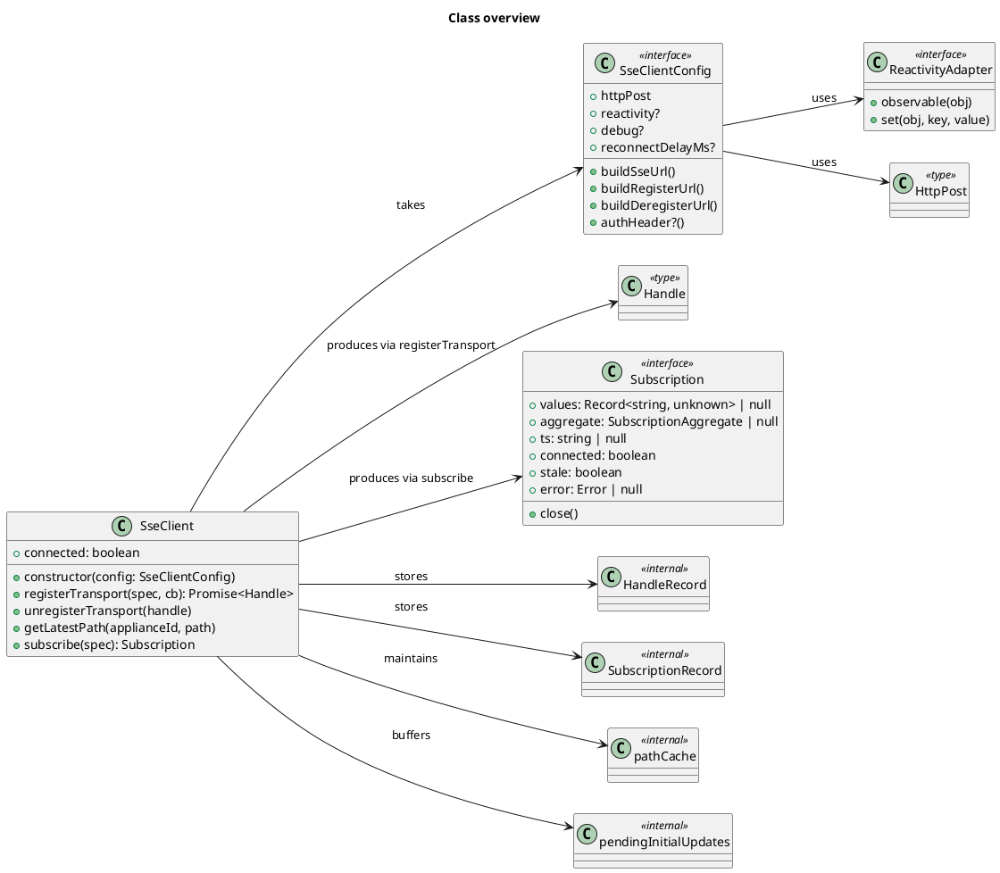

# sse-client

A small, portable TypeScript library that turns a server-sent-events stream of `transport-update` messages into one of two consumer-friendly shapes:

1. **`registerTransport(spec, callback)`** — classic Promise + callback API. You get a `Handle` back; you call `unregisterTransport(handle)` to stop. Each payload is delivered to your callback.
2. **`subscribe(spec)`** — reactive Subscription API. You get an object back whose fields update themselves as payloads arrive. Bind the fields in a template and forget about messages. Call `sub.close()` to stop.

The library is framework-agnostic. You wire it to your project by passing a `SseClientConfig` to the constructor, covering HTTP, URLs, auth, reactivity framework, and a few tuning knobs.

## Table of contents

- [What's in the box](#whats-in-the-box)
- [Install](#install)
- [Core concepts](#core-concepts)
- [Configuration](#configuration)
- [Reactivity adapters](#reactivity-adapters)
- [Diagrams](#diagrams)
  - [Connection lifecycle](#connection-lifecycle)
  - [Transport register + `pendingInitialUpdates` dispatch](#transport-register--pendinginitialupdates-dispatch)
  - [Subscription lifecycle](#subscription-lifecycle)
  - [Class overview](#class-overview)
- [Examples](#examples)
  - [Vue 2](#vue-2-example)
  - [Vue 3](#vue-3-example)
  - [Plain JS / no framework](#plain-js--no-framework-example)
  - [Aggregate subscription](#aggregate-subscription)
  - [Close-before-register is safe](#close-before-register-is-safe)
- [Choosing between `registerTransport` and `subscribe`](#choosing-between-registertransport-and-subscribe)

## What's in the box

```
sse-client/
├── index.ts        -- public re-exports
├── types.ts        -- all exported types (TransportSpec, Subscription, SseClientConfig, ...)
├── reactivity.ts   -- plainAdapter + createVue2Adapter(Vue) + createVue3Adapter({ reactive })
├── sseClient.ts    -- the SseClient class
└── README.md       -- this file
```

Zero runtime `import`s from `vue`, `axios`, or any specific project. The library compiles with the host project's TypeScript.

## Install

Copy the `sse-client/` folder into your project (e.g. `src/lib/sse-client/`). No `npm install` step — just import from it:

```ts
import {
  SseClient,
  Subscription,
  createVue2Adapter
} from './lib/sse-client'
```

If your host project has stricter TS settings than the library was written against, you may need to tweak the adapter imports or widen a type locally — the code is small enough that this is almost never a real obstacle.

## Core concepts

- **Transport** — a server-side subscription that bundles a selection (which appliance paths to watch) with a rate limit (`minInterval`). The server assigns each registered transport a `transportId`; updates arrive over the shared `EventSource` tagged with that id.
- **Handle** — the client-side token for one registered transport. `registerTransport` returns it; `unregisterTransport(handle)` tears it down.
- **Subscription** — a higher-level wrapper around a transport. Returns a reactive object (`sub.values`, `sub.aggregate`, `sub.ts`, `sub.connected`, `sub.stale`, `sub.error`) and a single `sub.close()` teardown method. No callbacks; you bind the fields.
- **Aggregate** — if your spec includes `aggregate: { op: 'sum' | 'avg' }`, the server delivers one aggregated scalar per tick instead of per-path values. The Subscription exposes it as `sub.aggregate` (`{ value, sampleCount, totalCount }`).
- **Wildcard paths** — a path of `'**'` tells the server "send every path of this appliance". The library adds keys to `sub.values` reactively as they arrive.
- **`representsGroups`** — if the server sends a triple with a `representsGroups: number[]` field (meaning "this value should mirror onto each of these member appliances"), the library also writes the value under each member's key, provided that member is in your subscription's selection.

## Configuration

Every integration point is a callback so the library can read fresh values on each call:

```ts
import { SseClient, SseClientConfig } from './lib/sse-client'

const config: SseClientConfig = {
  buildSseUrl: () => 'https://api.example.com/sse/stream',
  buildRegisterUrl: () => 'https://api.example.com/sse/transports/register',
  buildDeregisterUrl: () => 'https://api.example.com/sse/transports/deregister',

  // Optional — called before every HTTP request
  authHeader: () => ({ Authorization: 'Bearer ' + getAccessToken() }),

  // Inject your HTTP client. Axios:
  httpPost: async (url, body, headers) => {
    const res = await axios.post(url, body, { headers })
    return { data: res.data }
  },

  // Or native fetch:
  // httpPost: async (url, body, headers) => {
  //   const res = await fetch(url, {
  //     method: 'POST',
  //     headers: { 'Content-Type': 'application/json', ...headers },
  //     body: JSON.stringify(body)
  //   })
  //   return { data: await res.json() }
  // },

  // Optional — defaults to plainAdapter (no reactivity)
  reactivity: createVue2Adapter(Vue),

  // Optional
  debug: false,
  reconnectDelayMs: 3000
}

const sse = new SseClient(config)
```

## Reactivity adapters

`sse-client` ships three adapters. Pick the one that matches your framework, or write your own.

### `plainAdapter` (default)

Used when you don't pass a `reactivity` field. The `Subscription` object's fields are plain JavaScript — values update in place but nothing in a framework is notified. Use this if you want to poll the fields manually, wire your own change detection, or run in a non-UI context.

### `createVue2Adapter(Vue)`

```ts
import Vue from 'vue'
import { createVue2Adapter } from './lib/sse-client'

const sse = new SseClient({ ..., reactivity: createVue2Adapter(Vue) })
```

Internally uses `Vue.observable` + `Vue.set`. Works with Vue 2 template bindings, computed properties, and watchers.

### `createVue3Adapter({ reactive })`

```ts
import { reactive } from 'vue'
import { createVue3Adapter } from './lib/sse-client'

const sse = new SseClient({ ..., reactivity: createVue3Adapter({ reactive }) })
```

Internally uses Vue 3's `reactive()`. Dynamic-key writes use plain property assignment since Vue 3's `reactive` supports them natively.

## Diagrams

All diagrams are [PlantUML](https://plantuml.com/) source. Render them with a PlantUML-aware viewer (the VS Code PlantUML extension, a GitHub PlantUML proxy, or [plantuml.com's online editor](https://www.plantuml.com/plantuml/uml/)).

### Connection lifecycle

How the `EventSource` is opened, how a disconnect fires a reconnect, and how all live transports are re-registered against the fresh `connectionId`.



### Transport register + `pendingInitialUpdates` dispatch

The server can send the first `transport-update` for a new transport *before* the POST `/register` response arrives at the client. The library buffers these and replays once it knows which `transportId` belongs to which handle.



### Subscription lifecycle

What happens between `subscribe(spec)` and `sub.close()`. Note the synchronous return, the background server registration, and the generation-token close-before-registered race handling.



### Class overview

Who depends on whom at the module level.



## Examples

### Vue 2 example

```html
<template>
  <div>
    <p>Power: {{ sub.values ? sub.values['148:relays[0].power'] : '…' }} W</p>
    <p v-if="!sub.connected">Disconnected…</p>
    <p v-if="sub.stale">Stale</p>
  </div>
</template>

<script lang="ts">
import Vue from 'vue'
import axios from 'axios'
import { SseClient, createVue2Adapter, Subscription } from '@/lib/sse-client'

const sse = new SseClient({
  buildSseUrl: () => 'https://host/sse/stream',
  buildRegisterUrl: () => 'https://host/sse/transports/register',
  buildDeregisterUrl: () => 'https://host/sse/transports/deregister',
  authHeader: () => ({ Authorization: 'Bearer ' + store.getters['auth/token'] }),
  httpPost: (url, body, headers) => axios.post(url, body, { headers }).then(r => ({ data: r.data })),
  reactivity: createVue2Adapter(Vue)
})

export default Vue.extend({
  data: () => ({ sub: null as Subscription | null }),
  mounted () {
    this.sub = sse.subscribe({
      minInterval: 2000,
      selection: { perAppliance: [{ applianceId: 148, paths: ['relays[0].power'] }] }
    })
  },
  beforeDestroy () {
    this.sub?.close()
  }
})
</script>
```

### Vue 3 example

```ts
// client.ts — build once, import from components
import { reactive } from 'vue'
import axios from 'axios'
import { SseClient, createVue3Adapter } from './lib/sse-client'

export const sse = new SseClient({
  buildSseUrl: () => '/sse/stream',
  buildRegisterUrl: () => '/sse/transports/register',
  buildDeregisterUrl: () => '/sse/transports/deregister',
  httpPost: (url, body, headers) => axios.post(url, body, { headers }).then(r => ({ data: r.data })),
  reactivity: createVue3Adapter({ reactive })
})
```

```vue
<script setup lang="ts">
import { onBeforeUnmount, ref } from 'vue'
import { sse } from './client'
import type { Subscription } from './lib/sse-client'

const sub = ref<Subscription | null>(null)
sub.value = sse.subscribe({
  minInterval: 300,
  selection: { perAppliance: [{ applianceId: 177, paths: ['**'] }] }
})
onBeforeUnmount(() => sub.value?.close())
</script>

<template>
  <div v-if="sub">
    Brightness: {{ sub.values?.['177:brightness'] }}
  </div>
</template>
```

### Plain JS / no framework example

```ts
import { SseClient } from './lib/sse-client'

const sse = new SseClient({
  buildSseUrl: () => 'http://localhost:8080/sse/stream',
  buildRegisterUrl: () => 'http://localhost:8080/sse/transports/register',
  buildDeregisterUrl: () => 'http://localhost:8080/sse/transports/deregister',
  httpPost: async (url, body, headers) => {
    const res = await fetch(url, {
      method: 'POST',
      headers: { 'Content-Type': 'application/json', ...headers },
      body: JSON.stringify(body)
    })
    return { data: await res.json() }
  }
  // reactivity: omitted -> plainAdapter (no framework notifications)
})

const sub = sse.subscribe({
  minInterval: 1000,
  selection: { perAppliance: [{ applianceId: 148, paths: ['relays[0].power'] }] }
})

// Poll the plain object yourself:
setInterval(() => {
  console.log(sub.values?.['148:relays[0].power'], sub.connected, sub.stale)
}, 1000)

// Close when done:
// sub.close()
```

### Aggregate subscription

```ts
const agg = sse.subscribe({
  minInterval: 3000,
  selection: { perAppliance: [{ applianceId: 148, paths: ['relays[0].power', 'relays[1].power'] }] },
  aggregate: { op: 'sum' }
})

// agg.values === null
// agg.aggregate === { value: null, sampleCount: 0, totalCount: 0 }
// After first payload: agg.aggregate.value === <sum across the selected paths>
```

### Close-before-register is safe

```ts
const sub = sse.subscribe(spec)
sub.close()  // safe even before the server registration completes;
             // library will deregister the transportId once it lands.
```

## Choosing between `registerTransport` and `subscribe`

Use **`subscribe(spec)`** when you want:

- Template / computed binding against live values.
- Automatic delta merging (paths retain their last-known value across updates).
- Automatic `representsGroups` mirroring.
- A single `close()` to tear everything down.
- Staleness detection and connection-status fields.

Use **`registerTransport(spec, cb)`** when you want:

- Direct access to every raw payload (timestamps, arrays, the full triple including `representsGroups`).
- To run custom side effects per payload (e.g. trigger a canvas redraw, aggregate across callbacks).
- Maximum control over when and how values are written to your state.

Both APIs share the same underlying `EventSource`, so they compose — one component can use `subscribe`, another can use `registerTransport`, and they share the connection, `connectionId`, reconnect behavior, and `pathCache`.
